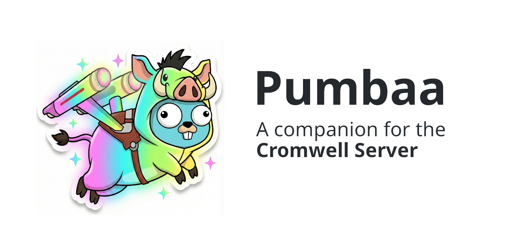

<p align="center">
  
</p>

<p align="center">
  <a href="https://github.com/lmtani/pumbaa/actions/workflows/ci.yml"></a>
  <a href="https://github.com/lmtani/pumbaa/releases"></a>
  <a href="https://goreportcard.com/report/github.com/lmtani/pumbaa"></a>
  <a href="LICENSE"></a>
</p>

Pumbaa is a CLI and terminal UI for the [Cromwell](https://cromwell.readthedocs.io/)
workflow engine, built for bioinformaticians running WDL pipelines. It covers the
whole loop around a workflow run — prepare and validate a submission, monitor it
live, debug failures down to a task's stderr, and analyze cost and resource
efficiency afterwards — and ships an AI chat agent that does all of this through
natural language.

📖 **[Documentation](https://lmtani.github.io/pumbaa/)**

<!-- TODO: record a terminal demo with `vhs docs/assets/demo.tape` (see the file
     for instructions) and embed docs/assets/demo.gif here. -->

## Features

- **[Interactive dashboard](https://lmtani.github.io/pumbaa/features/dashboard/)** — browse, inspect, and manage workflows in a real-time TUI (`pumbaa dashboard`).
- **[Debug view](https://lmtani.github.io/pumbaa/features/debug/)** — drill into a run's task tree, statuses, and logs to find the root cause of a failure (`pumbaa workflow debug`).
- **[AI chat agent](https://lmtani.github.io/pumbaa/features/chat/)** — ask about your workflows in natural language: failures, costs, logs, GCS files (`pumbaa chat`).
- **[Guided submit](https://lmtani.github.io/pumbaa/features/guided-submit/)** — scaffold an inputs JSON from the WDL and preflight everything (server, inputs, file paths, dependency zip) before submitting.
- **[Query & inspect](https://lmtani.github.io/pumbaa/features/query/)** — list workflows and fetch metadata, inputs, and outputs from the command line.
- **[Diff two runs](https://lmtani.github.io/pumbaa/features/diff/)** — compare inputs, options, source, and task-level differences between two executions.
- **[Resource & cost analysis](https://lmtani.github.io/pumbaa/features/resource-monitoring/)** — measure actual usage vs. allocated resources and get recommendations to cut over-provisioning.
- **[WDL bundling](https://lmtani.github.io/pumbaa/features/bundle/)** — package a workflow and all its imports into a single distributable zip (`pumbaa bundle`).

<p align="center">
  
</p>

## Installation

```bash
curl -sSL https://raw.githubusercontent.com/lmtani/pumbaa/main/install.sh | bash
```

Prefer not to pipe to bash? Grab a prebuilt binary from
[GitHub Releases](https://github.com/lmtani/pumbaa/releases) — Linux, macOS, and
Windows, amd64 and arm64 — or build from source:

```bash
git clone https://github.com/lmtani/pumbaa && cd pumbaa && make build
```

## Quick start

```bash
pumbaa config init        # interactive setup wizard (Cromwell host, LLM provider, ...)
pumbaa dashboard          # launch the interactive TUI
```

A few common commands:

```bash
pumbaa workflow query                                # list recent workflows
pumbaa workflow scaffold -w pipeline.wdl             # generate an inputs JSON template
pumbaa workflow submit -w pipeline.wdl -i inputs.json  # preflights, then submits
pumbaa workflow metadata <workflow-id>               # status of a run
pumbaa workflow debug --id <workflow-id>             # interactive failure debugging
pumbaa chat                                          # ask the AI agent about your runs
```

The chat agent needs an LLM provider (`ollama`, `vertex`, or `gemini`) — see
[Configuration](https://lmtani.github.io/pumbaa/getting-started/configuration/).

## Configuration

Settings are resolved in order: CLI flags > environment variables >
`~/.pumbaa/config.yaml` > defaults. The main environment variables:

| Variable | Purpose |
|---|---|
| `CROMWELL_HOST` | Cromwell server URL (default `http://localhost:8000`) |
| `PUMBAA_LLM_PROVIDER` | LLM backend for the chat agent: `ollama`, `vertex`, or `gemini` |
| `PUMBAA_WDL_DIR` | Directory of WDLs indexed for the agent's WDL tools |

Full reference: [configuration docs](https://lmtani.github.io/pumbaa/getting-started/configuration/).

## Using the WDL parser as a library

The ANTLR-based WDL parser under [`pkg/wdl`](pkg/wdl) is a public Go API — it
parses workflows, scaffolds inputs, and validates inputs and dependency zips
without any IO. See the
[package documentation](https://pkg.go.dev/github.com/lmtani/pumbaa/pkg/wdl).

## Development

Requires Go 1.25+.

```bash
make build           # outputs dist/pumbaa
make test            # run tests
make lint            # golangci-lint (CI gate)
make docs-serve      # preview the documentation site
```

### Project structure

```
cmd/cli/              # CLI entrypoint
internal/
  ├── domain/         # Business entities
  ├── application/    # Use cases and ports (hexagonal architecture)
  ├── infrastructure/ # External services (Cromwell, GCS, LLM)
  └── interfaces/     # CLI commands and TUI
pkg/wdl/              # WDL parser (ANTLR)
docs/                 # MkDocs documentation
```

See [ARCHITECTURE.md](docs/ARCHITECTURE.md) for the full picture and
[testing-guidelines.md](docs/testing-guidelines.md) for test conventions.

## Contributing

- 🐛 [Report bugs](https://github.com/lmtani/pumbaa/issues/new?template=bug_report.md)
- 💡 [Request features](https://github.com/lmtani/pumbaa/issues/new?template=feature_request.md)
- 💬 [Discussions](https://github.com/lmtani/pumbaa/discussions)
- 📖 [Contributing guide](https://lmtani.github.io/pumbaa/contributing/)

## License

Apache License 2.0 — see [LICENSE](LICENSE).
