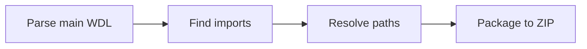

# Bundle Creation

Package WDL workflows with dependencies into ZIP files.

<div class="grid cards" markdown>

-   :material-package-variant: **Auto-Detection**

    Automatically finds all imported WDL files

-   :material-zip-box: **Single File**

    Creates a portable ZIP for submission

-   :material-link-variant: **Import Resolution**

    Resolves nested import paths

</div>

## :material-rocket-launch: Quick Start

```bash
pumbaa bundle create --workflow FILE --output FILE
```

## :material-flag: Flags

| Flag | Alias | Required | Description |
|------|:-----:|:--------:|-------------|
| `--workflow` | `-w` | :material-check: | Main WDL file |
| `--output` | `-o` | :material-check: | Output ZIP path |

## :material-cog: How It Works



1. Parses main WDL file
2. Finds all `import` statements
3. Resolves import paths
4. Packages all files into ZIP

## :material-lightbulb: Example

Given workflow structure:

```
pipeline.wdl
tasks/
  alignment.wdl
  calling.wdl
```

=== "Create Bundle"

    ```bash
    pumbaa bundle create \
      --workflow pipeline.wdl \
      --output bundle.zip
    ```

=== "Submit with Bundle"

    ```bash
    pumbaa workflow submit \
      --workflow pipeline.wdl \
      --dependencies bundle.zip
    ```

## :material-book-open-variant: See Also

- [:material-upload: Submit](submit.md) — Use bundles with submission
