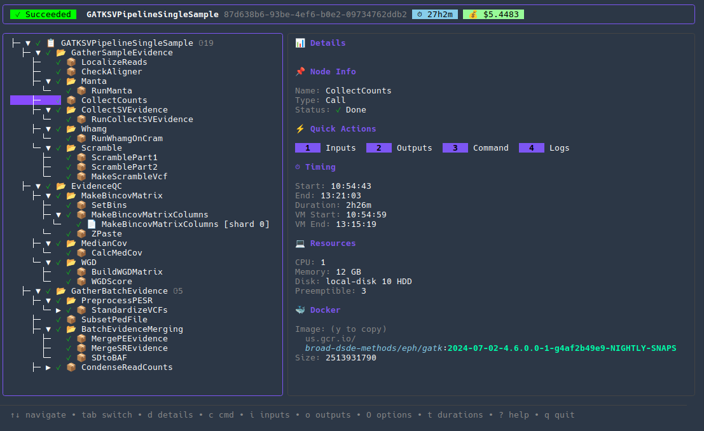

# Debug View

Inspect workflow execution tree and call-level details.

Note: the information shown depends on a working connection to your Cromwell server (set via `--host` or `CROMWELL_HOST`).



## Usage

From dashboard: Press `Enter` on any workflow

CLI:
```bash
pumbaa workflow debug <workflow-id>
```

## Keys

| Key | Action |
|-----|--------|
| `↑/↓` or `k/j` | Navigate tree |
| `→/←` or `l/h` | Expand/collapse |
| `Enter` or `Space` | Toggle expand |
| `d` | Show call details |
| `o` | Show logs |
| `q` or `Esc` | Back |

## Quick actions (1–4)

The details panel exposes quick actions for the selected call:

- `1` — Inputs: open a modal showing call inputs.
- `2` — Outputs: open a modal showing call outputs.
- `3` — Command: open a modal showing the command executed by the call.
- `4` — Logs: switch to the Logs view for the selected call. Logs can be loaded from Google Cloud Storage if your environment has Google Application Default Credentials configured (or from local paths when available).

In the modals you can press `y` to copy the displayed content to the system clipboard (works when the host environment provides a clipboard tool such as `xclip`, `xsel`, or `wl-copy`).


## Timing

Press `t` to open the timeline (global timeline) for the selected workflow or subworkflow. To inspect a subworkflow's timing, navigate to the subworkflow in the tree and press `t` — Pumbaa will show a timeline for that workflow. Timing and task durations update as you fetch or expand subworkflows (again, this requires the Cromwell server to be reachable).


## See Also

- [Dashboard](dashboard.md)
- [Metadata](metadata.md)
