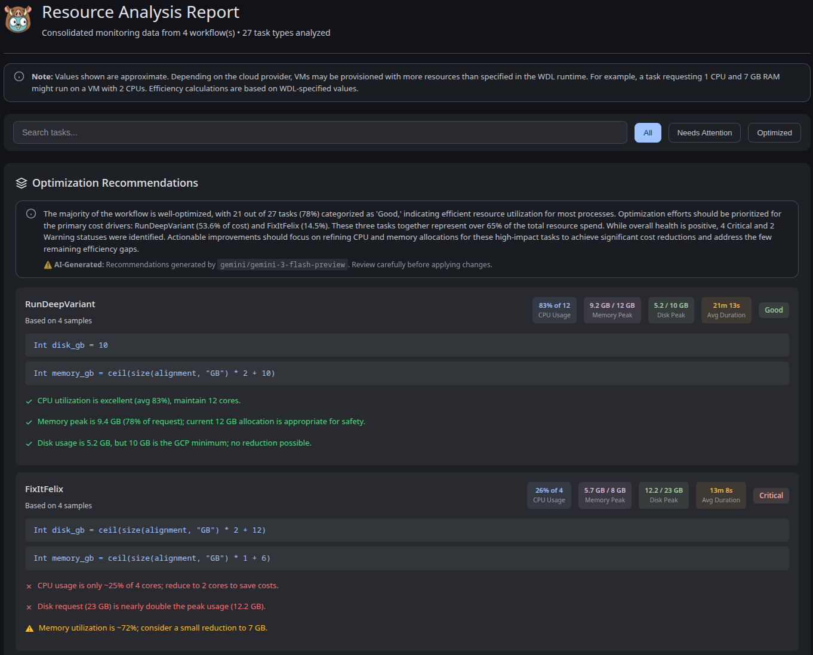
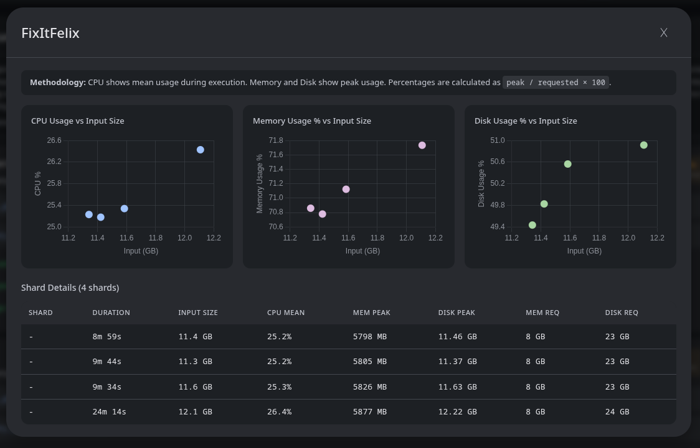

# Resource Analysis

**Pumbaa** provides a structured and data-driven way to analyze resource utilization in Cromwell-executed workflows. By processing monitoring logs, it enables a per-task evaluation of **CPU, memory, and disk usage**, allowing you to correlate resource consumption with input size and identify concrete optimization opportunities.

The analysis workflow is composed of **two independent steps**:

1. **Data collection** — process monitoring logs for a specific workflow execution.
2. **Visualization and interpretation** — aggregate one or more reports into an interactive dashboard.

---

## Step 1 — Data Collection

Data collection is performed using the `pumbaa workflow resource-report` command. This step analyzes the monitoring logs of a single workflow execution and produces a normalized TSV report with per-task metrics.

### Prerequisites

To generate a resource report, the workflow execution must meet the following requirements:

- **Monitoring enabled**  
  The workflow must have been executed with Cromwell options that enable the resource monitoring script. This script periodically records CPU, memory, and disk usage for each task.

- **Accessible task inputs**  
  Input files referenced by tasks must be accessible (e.g., GCS or local filesystem). Pumbaa computes total input size per task to support *resource usage vs. data volume* analysis.

### Usage

Run the command with the target Workflow ID:

```bash
pumbaa workflow resource-report [flags] <workflow-id>
```

**Flags**

* `--concurrency`, `-c`
  Number of concurrent workers used to fetch monitoring logs (default: `5`).

### What This Command Does

1. **Metadata retrieval**
   Fetches workflow metadata from the Cromwell server.

2. **Recursive traversal**
   Walks the full workflow graph, including subworkflows, collecting all calls that expose monitoring logs.

3. **Input size calculation**
   Computes the total size of input files per task to enable efficiency and scaling analysis.

4. **Monitoring log parsing**
   Downloads and parses per-task monitoring TSVs to derive:

     * Peak memory usage
     * Peak disk usage
     * Mean CPU utilization

5. **Report generation**
   Writes the aggregated results to `<workflow-id>.tsv` in the current working directory.

---

## Step 2 — Visualization and Analysis

Once one or more TSV reports have been generated, the `pumbaa analyze resources` command aggregates them into an interactive HTML dashboard.

### Usage

Point the command to a directory containing one or more TSV files:

```bash
pumbaa analyze resources [flags] <directory>
```

**Flags**

* `--output`, `-o`
  Output path for the generated HTML report
  (default: `resource_report.html`)

* `--no-llm`
  Disable LLM-based optimization recommendations. Useful for offline usage or faster generation.

* `--llm-batch-size`
  Number of tasks analyzed per LLM request (default: `25`).

---

## Dashboard Features

### Interactive Overview

The generated output is a **self-contained HTML file**, viewable in any modern browser. It provides both a high-level summary of workflow efficiency and detailed per-task metrics.



---

### Optimization Recommendations (LLM)

When enabled, Pumbaa uses a Large Language Model (LLM) to analyze task-level metrics and generate actionable optimization recommendations. Common patterns include:

* Over-provisioned memory leading to unnecessary cost
* Low CPU utilization causing suboptimal runtimes
* Disk usage outliers and scaling anomalies

> **Note**
> When running with `--no-llm`, the report includes only descriptive statistics and visualizations, without automated optimization guidance.

---

### Efficiency Scatter Plots

Selecting an individual task opens a detailed modal view with efficiency plots such as **Memory Usage vs. Input Size**. These plots are particularly useful for:

* Identifying non-linear scaling behavior
* Detecting tasks with inconsistent resource profiles
* Validating runtime assumptions across varying input sizes



