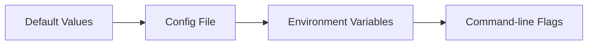

# Configuration

Pumbaa can be configured through the interactive wizard, command-line flags, environment variables, or a configuration file.

---

## :zap: Quick Setup (Recommended)

```bash
pumbaa config init
```

This wizard guides you through:

1. :robot: Choosing your LLM provider (Ollama, Gemini API, or Vertex AI)
2. :key: Provider-specific settings (API key, model, etc.)
3. :link: Cromwell server URL
4. :file_folder: Optional WDL directory for chat context

!!! info "Config Location"
    Configuration is saved to `~/.pumbaa/config.yaml`

---

## :terminal: Configuration Commands

```bash
# Interactive setup wizard
pumbaa config init

# Set individual values
pumbaa config set <key> <value>

# Get a value
pumbaa config get <key>

# List all configuration
pumbaa config list

# Show config file path
pumbaa config path
```

---

## :gear: Available Keys

| Key | Description | Example |
|-----|-------------|---------|
| `llm_provider` | LLM backend | `ollama`, `gemini`, `vertex` |
| `cromwell_host` | Cromwell server URL | `http://localhost:8000` |
| `ollama_host` | Ollama server URL | `http://localhost:11434` |
| `ollama_model` | Ollama model name | `llama3.2:3b` |
| `gemini_api_key` | Gemini API key | `AIza...` |
| `gemini_model` | Gemini model | `gemini-2.0-flash` |
| `vertex_project` | GCP project ID | `my-project` |
| `vertex_location` | Vertex AI region | `us-central1` |
| `vertex_model` | Vertex AI model | `gemini-2.0-flash` |
| `wdl_directory` | WDL files for context | `/path/to/workflows` |

---

## :arrows_counterclockwise: Configuration Priority

Settings are applied in this order (later overrides earlier):



---

## :link: Cromwell Server

=== "Config Command"

    ```bash
    pumbaa config set cromwell_host http://cromwell.example.com:8000
    ```

=== "Environment Variable"

    ```bash
    export CROMWELL_HOST=http://cromwell.example.com:8000
    ```

=== "Command-line Flag"

    ```bash
    pumbaa --host http://cromwell.example.com:8000 dashboard
    ```

!!! note "Default"
    The default host is `http://localhost:8000`

---

## :robot: Chat LLM Providers

=== ":material-google: Gemini API"

    Get your API key at [Google AI Studio](https://aistudio.google.com/apikey).

    ```bash
    pumbaa config set llm_provider gemini
    pumbaa config set gemini_api_key <your-api-key>
    ```

=== ":material-server: Ollama (Local)"

    ```bash
    pumbaa config set llm_provider ollama
    pumbaa config set ollama_host http://localhost:11434
    pumbaa config set ollama_model llama3.2:3b
    ```

=== ":material-cloud: Vertex AI"

    ```bash
    pumbaa config set llm_provider vertex
    pumbaa config set vertex_project <project-id>
    pumbaa config set vertex_location us-central1
    ```

---

## :lock: Authentication

Pumbaa assumes a direct connection to a reachable Cromwell server; it does not perform authentication itself.

??? example "Port-forwarding from Kubernetes"
    ```bash
    kubectl -n <namespace> port-forward svc/cromwell 8000:8000
    pumbaa config set cromwell_host http://localhost:8000
    ```

---

## :bar_chart: Telemetry

Pumbaa collects **anonymous** usage statistics to help improve the tool.

<div class="grid" markdown>

!!! success "What we collect"
    - Command name (e.g., `pumbaa chat`)
    - Pumbaa version
    - OS / Architecture
    - Execution duration
    - Success/Failure status

!!! danger "What we DO NOT collect"
    - Argument or flag values
    - File paths or API keys
    - File contents
    - Personal information

</div>

### Opt-Out

=== "Config Command"

    ```bash
    pumbaa config set telemetry_enabled false
    ```

=== "Environment Variable"

    ```bash
    export PUMBAA_TELEMETRY_ENABLED=false
    ```

---

## :books: Next Steps

- [:material-play: Quick Start](quick-start.md) — Run your first commands
- [:material-view-dashboard: Dashboard](../features/dashboard.md) — Interactive workflow management
- [:material-robot: Chat Agent](../features/chat.md) — Query with AI
